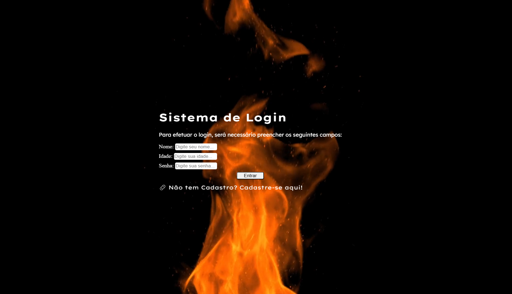

## 🔐 Sistema de Login Simples

Projeto desenvolvido com o objetivo de praticar conceitos fundamentais de front-end.

🚀 Tecnologias utilizadas

- HTML5
- CSS3
- JavaScript

## 🎯 Funcionalidades

- Layout responsivo para diferentes tamanhos de tela.
- Inputs com feedback visual (focus e hover).
- Botão interativo com animações.
- Animação de entrada suave (CSS keyframes).
- Vídeo de fundo dinâmico.
- Validação com possíveis saídas diferentes.

## 📱 Responsividade

O projeto foi adaptado para funcionar em dispositivos móveis utilizando `@media queries`.

## 🎨 Animações

- Transições suaves com `transition`
- Animações com `@keyframes`
- Feedback visual com `hover`, `focus` e `active`

## 📚 Objetivo

Este projeto faz parte do meu processo de aprendizado em desenvolvimento front-end, com foco em:

- Estruturação de layout.
- Responsividade.
- Experiência do usuário (UX).
- Primeiros contatos com animações.
- Primeira vez usando JavaScript em um projeto.

---

## 🖼️ Preview

## 🌐 Acesse o projeto

👉 https://nathanmatos38.github.io/login-simples/

📚 Projeto desenvolvido para fins de aprendizado e prática de front-end.
