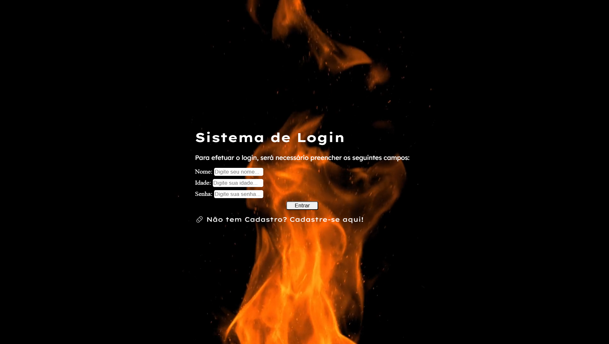

# 🔐 Sistema de Login Simples

Aplicação web desenvolvida com **HTML5, CSS3 e JavaScript**, utilizada como projeto prático para desenvolvimento Front-End e, posteriormente, como base para aplicação de **processos de Qualidade de Software (QA)**.

O projeto passou por um ciclo completo de validação, incluindo **planejamento de testes, definição de regras de validação, elaboração de casos de teste, execução de testes, identificação e documentação de bugs, correções, retestes, testes de regressão e validação da versão publicada**.

---

## 🧪 Qualidade de Software / QA

O projeto foi analisado sob a perspectiva de **QA**, utilizando uma abordagem de **testes manuais**.

Durante o processo foram realizados:

* 🔎 Testes exploratórios;
* 📋 Definição de regras funcionais;
* 🧪 Elaboração de casos de teste;
* 📊 Criação de uma baseline;
* 🐛 Identificação e documentação de bugs;
* 📸 Registro de evidências;
* 🔧 Correção dos defeitos encontrados;
* 🔄 Retestes;
* 🔁 Testes de regressão;
* 🌐 Validação da versão publicada;
* 📄 Documentação completa do ciclo de testes.

### 📊 Resultado final

| Resultado | Baseline | Versão final |
| --------- | -------: | -----------: |
| ✅ PASS    |       31 |       **36** |
| ❌ FAIL    |        5 |        **0** |
| ⚪ BLOCK   |        0 |        **0** |
| **Total** |   **36** |       **36** |

### 🏆 Resultado da validação

**36/36 casos de teste aprovados — 100% PASS**

Todos os cinco casos que apresentaram falha na baseline foram corrigidos, retestados e aprovados na versão final.

---

## 🐛 Bugs identificados e corrigidos

Durante a execução da baseline foram identificados **3 bugs**:

### BUG-001 — Espaços no início ou no final do campo Nome

A aplicação permitia o acesso quando o nome possuía espaços no início ou no final.

**Status:** ✅ Corrigido e retestado

### BUG-002 — Números no campo Nome

A aplicação permitia caracteres numéricos no campo Nome.

**Status:** ✅ Corrigido e retestado

### BUG-003 — Idade acima do limite

A aplicação permitia acesso com idades superiores a 100 anos.

**Status:** ✅ Corrigido e retestado

---

## 📚 Documentação de QA

Toda a documentação produzida durante o ciclo de testes está disponível no diretório [`QA/`](./QA/).

### Documentos

* 📋 [QA.md](./QA/QA.md) — Documentação principal do projeto de QA, incluindo objetivo, escopo, ambiente, regras funcionais, estratégia, execução, bugs, evidências, correções, retestes, resultado final e conclusão.
* 🧪 [CASOS-DE-TESTE.md](./QA/CASOS-DE-TESTE.md) — Suíte completa contendo os 36 casos de teste.
* 🐛 [BUG-REPORT.md](./QA/BUG-REPORT.md) — Registro detalhado dos bugs identificados durante a baseline.
* 📐 [REGRAS-DE-VALIDACAO.md](./QA/REGRAS-DE-VALIDACAO.md) — Regras de validação definidas para os campos da aplicação.
* 📸 [Evidências](./QA/evidencias/) — Evidências coletadas durante a execução dos testes.

---

## 🎯 Funcionalidades

A aplicação possui as seguintes funcionalidades:

* Layout responsivo para diferentes tamanhos de tela;
* Inputs com feedback visual;
* Botão interativo com animações;
* Animação de entrada utilizando CSS `@keyframes`;
* Vídeo de fundo dinâmico;
* Validação dos campos de entrada;
* Diferentes mensagens de feedback para as tentativas de login;
* Funcionalidade de mostrar e ocultar senha;
* Validação de idade mínima e máxima;
* Validação da senha;
* Validação do campo Nome.

---

## 🔐 Regras de validação

### Campo Nome

* Obrigatório;
* Aceita letras maiúsculas e minúsculas;
* Não permite números;
* Não permite espaços no início ou no final.

### Campo Idade

* Maior ou igual a 18 anos;
* Máximo de 100 anos;
* Máximo de 3 dígitos;
* Não permite caracteres não numéricos.

### Campo Senha

* Deve corresponder ao valor pré-definido `1234`.

---

## 📱 Responsividade

A aplicação foi desenvolvida para diferentes tamanhos de tela utilizando CSS e `@media queries`.

Durante os testes foram avaliados os seguintes viewports:

* `1440 × 842`
* `1024 × 842`
* `768 × 842`
* `425 × 842`
* `375 × 842`
* `320 × 842`

Todos os **6 casos de teste de responsividade foram aprovados** na baseline.

---

## 🎨 Front-End

### Tecnologias utilizadas

* HTML5
* CSS3
* JavaScript

### Animações e interação

* `transition`
* `@keyframes`
* `hover`
* `focus`
* `active`
* Alternância entre mostrar e ocultar senha

---

## 🔎 Estratégia de Testes

A estratégia de testes foi construída a partir da exploração inicial da aplicação e posteriormente estruturada em diferentes grupos de cenários.

A suíte foi organizada em:

1. **Happy Path**
2. **Variações de Entrada**
3. **Entradas Inválidas / Sem Correspondência**
4. **Valores Limites**
5. **Responsividade**
6. **Botão Entrar**
7. **Botão Mostrar/Ocultar Senha**

A abordagem permitiu avaliar tanto os comportamentos esperados quanto entradas alternativas, inválidas e casos de borda.

---

## 📈 Evolução da qualidade

```text
BASELINE
31 PASS | 5 FAIL | 0 BLOCK
        │
        ▼
Correções + Retestes + Regressão
        │
        ▼
VERSÃO FINAL
36 PASS | 0 FAIL | 0 BLOCK
```

**Resultado final:** 100% dos casos de teste aprovados.

---

## 🖼️ Preview



---

## 🌐 Acesse o projeto

👉 [Login Simples — GitHub Pages](https://nathanmatos38.github.io/login-simples/)

---

## 📚 Objetivo do projeto

O projeto teve início como uma prática de desenvolvimento Front-End, com foco em:

* Estruturação de páginas
* Responsividade
* Experiência do usuário
* CSS e animações
* Primeiros contatos com JavaScript

Posteriormente, a aplicação foi utilizada como base para aplicar conhecimentos de **Qualidade de Software**, permitindo praticar um ciclo completo de testes manuais:

`Planejamento` → `Exploração` → `Casos de Teste` → `Baseline` → `Execução` → `Bug Report` → `Correção` → `Reteste` → `Regressão` → `Validação Final`

---

## 👨‍💻 Projeto

Desenvolvido por **Nathan Matos** como projeto prático de aprendizado em Front-End e QA.
